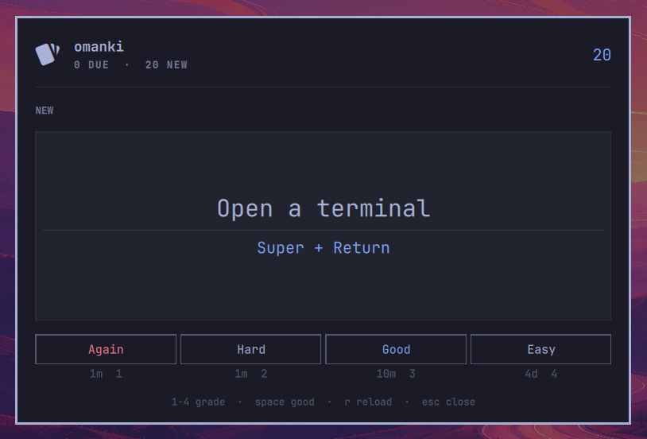

<p align="center">
  
</p>

<h1 align="center">omanki</h1>

<p align="center">
  <a href="https://github.com/yamz8/omanki/actions/workflows/tests.yml">
    
  </a>
</p>

Spaced-repetition flashcards in the Omarchy bar, scheduled the way Anki
schedules them.

There are two surfaces onto the same deck:

- **The bar panel.** Click the glyph to clear a few cards in passing.
- **The fullscreen overlay.** `Super + Ctrl + J` for actually sitting down to a
  deck — a bigger card face, on a surface with nothing else on it.

Both run the same session and write the same progress, so a card answered in
one is answered in the other. Either way the loop is the same: question, space
to reveal, then one of four grades, each labelled with when the card would
come back.

https://github.com/user-attachments/assets/5f6f7fe7-9a2c-4d74-9281-ffa86d0405d3

*The bar panel, mid-session — a deck of Omarchy's own keybindings.*

[Introducing omanki →](https://x.com/yamzeight/status/2099811274179625152)

## Install

```bash
omarchy plugin add https://github.com/yamz8/omanki.git --enable
```

That clones the repo into `~/.config/omarchy/plugins/yamz8.omanki/`, validates
it against the plugin manifest schema, and offers to place the bar widget. To
update later:

```bash
omarchy plugin update yamz8.omanki
```

A fresh install has no deck, so the panel opens on `No cards yet`. The repo
ships one to start from — 33 cards covering Omarchy's own keybindings and
commands, which is what the plugin was written to learn:

```bash
mkdir -p ~/.local/share/omanki
cp ~/.config/omarchy/plugins/yamz8.omanki/cards.example.json \
   ~/.local/share/omanki/cards.json
```

Copying it is the only time anything places a deck for you; the plugin itself
never writes one unless you add a card through the `a` composer.

The fullscreen overlay is summoned by a keybind, which you add yourself — see
[Placing it and binding it](#placing-it-and-binding-it) below.

## Placing it and binding it

`omarchy plugin add --enable` offers to place the bar widget. If you skipped
that, or want it somewhere else:

```bash
omarchy bar put yamz8.omanki --section right
```

Or add `{ "id": "yamz8.omanki" }` to a section of `bar.layout` in
`~/.config/omarchy/shell.json` by hand.

The overlay has no default keybind. In `~/.config/hypr/bindings.lua`:

```lua
o.bind("SUPER + CTRL + J", "omanki", "omarchy-shell shell toggle yamz8.omanki")
```



Pick that key with care. `SUPER + CTRL + M` looks free and is not — it sits one
modifier key away from Omarchy's stock `SUPER + SHIFT + M` "Music" binding, and
missing Ctrl for Shift launches `omarchy-launch-spotify`, which offers to
install Spotify if it is absent. Check a candidate against the live table
rather than the config, since the two can disagree:

```bash
omarchy menu keybindings --print | grep -i "SUPER CTRL"
```

A note if you are hacking on this: the Omarchy shell hot-reloads plugin code,
but this plugin sets `keepLoaded: true` so the session survives between
summons — which also means the shell holds the overlay instance across close
and never rebuilds it from changed source. Editing a `.qml` and reopening
shows you the old object; `omarchy-shell shell rescanPlugins` does not help
either. Run `omarchy restart shell` to see a change. Setting `keepLoaded` to
`false` restores ordinary save-and-reopen reloading if you want it while
iterating, at the cost of a cold session each summon.

Separately, a shell process that started *before* the plugin directory existed
cannot load a newly added overlay entry point at all — Qt caches its view of
the filesystem and reports it as a spurious "File name case mismatch". The
same restart clears it.

## Keys

| Key | Does |
|-----|------|
| `space` / `enter` | Reveal the answer, then grade it Good |
| `1` `2` `3` `4` | Again / Hard / Good / Easy |
| `u` | Undo the last answer |
| `s` | Statistics |
| `←` `→` or `h` `l` | Move between statistics tabs (bar panel) |
| `l` | Restore suspended leeches (overlay) |
| `a` | Add a card (overlay only) |
| `r` | Reload the deck from disk |
| `esc` | Close |

Same keys on both surfaces, apart from `a`: the composer is a form, and a form
typed into a popup that closes when it loses focus is not a trade worth making.
`Super + Ctrl + J` toggles the overlay; the bar glyph toggles the panel.

`Tab` is left alone. It moves between bar panels, which is the shell's own
convention and every other panel answers it that way — so the statistics tabs
are walked with the arrow keys instead, which is what a row of tabs suggests.

In the bar panel `h` and `l` walk them too, because the shell turns those into
movement before any panel sees them. That is also why `l` cannot mean "restore"
there the way it does in the overlay: the key never arrives. The panel's leech
tab carries a button instead, which is the more discoverable of the two anyway.

## Undo

`u` takes back the last answer. The card returns to exactly the state it was in
— interval, ease, lapse count, and the day's new-card allowance — and comes
back **revealed and in front of you**, so the next keystroke can be the grade
you meant. Taking back a card's very first answer removes its history
altogether rather than leaving a zeroed entry behind, so it counts as new
again.

You can walk back up to 25 answers. The stack lives in memory and is per
sitting: it starts empty each time a surface opens, and each surface keeps its
own. That is deliberate — undo is for the grade you just fumbled, and a
snapshot from an hour ago may no longer be true after the other surface has
been answering the same deck.

`u undo` appears in the footer only when there is something to take back.

## Statistics and adding cards

`s` on either surface, `a` in the overlay.

The two statistics views show the same numbers and are laid out for the room
they have. The overlay is a whole screen, so it puts the deck's composition,
the week ahead, six figures and the leeches on one page. The panel is about a
card wide, where that same page would be a column of squeezed rows saying
everything badly — so it uses **tabs**: `DECK`, `DUE`, `TODAY`, and `LEECHES`
once there is a leech to show. One thing at a time, each sized to the space
actually there, and the strip says what else there is, which a scrolling column
never does. Walk them with `←` and `→`, or click.

The strip rides on the end of the `STATISTICS` line rather than sitting under
it. A row of small-caps tabs directly below the small-caps word crowded both and
spent a row of a panel that has few to spare.

Both read the same numbers, so there is one calculation behind two
presentations rather than two of either.

**Statistics** shows the deck's composition — mature, young, learning, new —
what falls due over the next seven days, and today's figures. Everything is
derived from the cards themselves; the plugin keeps no review log, so
*retention* is a lifetime figure per card (answers that never had to be
relearned) rather than Anki's rolling window, and the view says so rather than
letting the number be misread.

**Leeches** appear in both, but only once there are any — a deck without them
says nothing about them, and in the panel the tab itself stays away. You get
the count, how many are suspended, and a way to put every suspended card back:
`l` in the overlay, or the button on the panel's leech tab. That is deliberately
the same view as the count: there is no card browser to go hunting in, so the
count and the way back have to be in one place or suspending would be a
one-way door. Restoring keeps the leech mark, so a card that goes on lapsing is
raised again at the next threshold rather than immediately.

When a card becomes a leech mid-session, the surface says so at the moment it
happens rather than letting the card quietly vanish.

**Adding a card** is the overlay's alone, and takes a front, a back, and
optional comma-separated tags;
`enter` moves between fields and saves from the last one. The form clears and
stays open, so a run of cards is one flow.

Writing goes read-modify-write over the deck's actual text, so existing cards
keep their order and every field they had, including ones this plugin knows
nothing about. Two things it will not do: overwrite a deck it could not parse —
it hands the file back untouched and says so — or accept a front that already
exists, since a card is identified by its front and a duplicate would share one
schedule and never be seen. What it does not preserve is your *formatting*: the
file is reserialized at two-space indent, so hand-tuned whitespace does not
survive an in-app add.

## Your deck

Cards live in `~/.local/share/omanki/cards.json`, which is yours to edit:

```json
{
  "cards": [
    { "front": "Toggle the scratchpad", "back": "Super + S", "tags": ["omarchy"] }
  ]
}
```

A bare `[ ... ]` array works too. Entries missing a front or a back are
skipped rather than shown blank, and the panel says so if the file does not
parse. Press `r` in the panel, or just close and reopen it, to pick up edits.

[`cards.example.json`](cards.example.json) in this repo is a working deck in
this format — copy it as shown in [Install](#install), or read it as a worked
example before writing your own.

A card is identified by a hash of its **front**, not by its position in the
file, so you can reorder the deck or fix a typo on the back without losing a
card's history. Changing the front is deliberately a new card — the question
changed, and the old schedule was earned answering a different one. Set an
explicit `"id"` on a card if you want to edit a front and keep its progress.

Scheduling progress is kept separately, in
`~/.local/state/omarchy/omanki.json`, so nothing the plugin writes can clobber
the deck you are writing by hand. Deleting that file resets every card to new
and leaves your deck alone.

Both surfaces can be open at once and both write that file, so every save is
read-merge-write rather than a blind overwrite: the document on disk is read
back, reconciled per card by which entry changed most recently, and only then
replaced. Without that, whichever surface saved last would erase whatever the
other had just answered.

## Settings

Set these on the plugin's entry in `~/.config/omarchy/shell.json`; it
hot-reloads on save.

| Setting | Default | Does |
|---------|---------|------|
| `deck` | `~/.local/share/omanki/cards.json` | Path to the deck file. `~` is expanded. |
| `newPerDay` | `20` | How many unseen cards to introduce per study day. `0` reviews only. |
| `showCount` | `true` | Show the waiting count next to the bar glyph. |
| `tags` | *(none)* | Restrict the session to cards carrying any of these tags. |
| `reviewsPerDay` | `0` | Cap how many due cards a day serves. `0` means no cap. |
| `lapsePercent` | `50` | How much of a forgotten card's interval survives, as a percentage. `0` is Anki's default. |
| `leechThreshold` | `8` | Lapses before a card counts as a leech. `0` turns leeches off. |
| `leechSuspend` | `true` | Take a leech out of the rotation rather than only marking it. |

```json
{ "id": "yamz8.omanki", "newPerDay": 10, "deck": "~/notes/spanish.json", "tags": ["verbs"] }
```

`reviewsPerDay` caps only *reviews* — cards that existed before today. Cards
introduced today are the `newPerDay` allowance's business, so a day of new
cards cannot silently eat the review budget. When the cap bites, the most
overdue cards are the ones served.

`tags` takes a list or a bare string, matches case-insensitively, and is a
union rather than an intersection — `["verbs", "food"]` keeps a card carrying
either. An untagged card is excluded whenever a filter is set. Both surfaces
share the filter and show it in the header (`NEW · #verbs`), so a short session
is never mistaken for an empty deck.

Everything except `tags` is declared in `manifest.json` under `barWidget`, with
types and ranges, so the shell knows the defaults without being told. `tags` is
left out on purpose: a declared string field would be written as one value, and
a filter is a *list* — `"verbs, food"` would be read as a single tag by that
name and match nothing. It stays a hand-edited array until it can be offered
as one honestly.

Note that settings are read when the shell builds the widget: adding a key to
an existing entry did not take effect here until `omarchy restart shell`, even
though layout changes hot-reload.

## How the scheduling works

SM-2, in the shape Anki uses it.

A **new** card is shown after 1 minute, then after 10, then graduates to a
1-day interval. *Easy* skips straight to 4 days. Nothing in this phase touches
ease — a card you have not learned yet has no history to judge it by.

A **review** card's interval is multiplied by its ease factor (2.5 to start).
*Hard* multiplies by 1.2 and costs 150 ease, *Good* multiplies by the ease
itself, *Easy* adds a 1.3 bonus and earns 150 ease. Ease is held between 1.3
and 3.0. The ease a grade earns or costs applies to the *next* answer, not the
one that earned it — Anki picks the interval before it moves the factor, so
*Easy*'s bonus multiplies the factor the card arrived with.

The three passing grades are worked out as one chain, each floored a day above
the one below it. That is what guarantees a passing grade always pushes a card
further out than it was even when the multiplier rounds to nothing, and that
*Hard* can never schedule a longer gap than *Good*.

**Answering late counts for something.** If a card was due in ten days, you did
not see it for fifty, and you still knew it, then your memory holds it for
something like fifty days rather than ten — and scheduling from the ten throws
away what the answer just demonstrated. So *Good* adds half the lateness to the
interval before multiplying, and *Easy* adds all of it:

| 10-day card, answered | *Good* gives |
|---|---|
| on time | 25 days |
| 20 days late | 50 days |
| 40 days late | 75 days |

*Hard* credits none of it — a struggle is not evidence of comfortable recall,
however long the gap was. Answering **early** earns nothing and costs nothing.

This matters more here than it does in Anki. A bar widget is for clicking in
passing, so coming back to a backlog is the normal case rather than the
exception; without the credit, every card you still know would be re-served far
sooner than the evidence warrants and the backlog would rebuild faster than it
should.

Each new interval is then **spread** over a small band around itself — a few
percent for a long one, proportionally more for a short one, the same bands
Anki uses. Cards answered together otherwise come due together and stay that
way, and a deck built in a few sittings collapses into a few permanent clumps.
The spread is applied when you answer, not when the grades are priced, so the
interval on each button is the unspread one and holds still while you decide.
Lapses and leaving relearning are not spread: those restore an interval the
card already had rather than computing a new one.

*Again* on a review card is a **lapse**: it costs 200 ease, cuts the interval,
and sends the card through a 10-minute relearning step. Coming out of
relearning restores whatever the lapse left rather than starting over, so the
cut is what decides where a forgotten card lands when it comes back.

How deep that cut goes is `lapsePercent`, and it defaults to **50** — half the
interval survives. Anki calls the same setting *New interval* and defaults it
to **0**, which sends a forgotten card back to a single day however long it had
been holding. Both are defensible and the disagreement is genuine: at 0 the
card was forgotten, so the spacing that produced the forgetting has been
disproved; at 50 one slip on a card held for months is weak evidence against
months of successful recall, and starting over throws away the rest. Set it to
`0` for Anki's behaviour.

The result is floored at one day whatever the percentage, which is Anki's
minimum interval — a setting it also exposes and this one does not, a day being
the only value that has ever made sense for it. A lapse always costs the same
200 ease and always relearns, at every percentage; only the interval waiting on
the other side changes.

A card that keeps being forgotten becomes a **leech**. Past some number of
lapses the card is the problem rather than your memory — the question is
ambiguous, or it is really two facts sharing one front — and grinding it every
few days costs more than it returns. At eight lapses omanki marks the card and
takes it out of the rotation; it is raised again every four lapses after that,
so a leech you decide to keep does not nag on every slip. Both numbers follow
Anki's.

A suspended card is hidden, not rewritten. Its interval, ease and due date go
on being exactly what the scheduler last made them, so restoring one puts it
back where it was rather than at the beginning.

Anki also tags the note `leech`. This plugin does not, because the deck is your
file: it is only ever written through the `a` composer, and writing a tag into
it on a lapse would break that for a card you never touched. The mark lives in
the progress file instead, and the statistics view is where you see it.

Set `leechThreshold` to `0` to turn leeches off, or `leechSuspend` to `false`
to mark them without taking them out.

The study day rolls over at **4am** local time, not midnight, so a card
answered at 1am counts toward the day you are still awake in. That is what the
`newPerDay` allowance is measured against.

## Troubleshooting

**Everything disappeared after `omarchy refresh shell`.** That command resets
`~/.config/omarchy/shell.json` to Omarchy's defaults, and a third-party plugin
is enabled by the presence of its id in that file — the shell's storage rules
put it plainly: *a third-party plugin is enabled iff its id appears somewhere
in shell.json*. Resetting the file takes omanki's entry with it, so the bar
glyph goes and `Super + Ctrl + J` stops responding too; a disabled plugin is
never summoned, and the only trace is one line in the shell's log. Nothing is
lost — your deck and your progress are separate files and are untouched. Put
it back with:

```bash
omarchy plugin enable yamz8.omanki
```

The config you had before is saved next to the new one as
`~/.config/omarchy/shell.json.bak.<timestamp>`, if there was more in it than
this one entry.

**The count next to the glyph looks stale.** Press `r` in the panel to re-read
the deck, or close and reopen it. A closed surface re-reads both files once a
minute on its own.

**A new setting had no effect.** Settings are read when the shell builds the
widget, so a key added to an existing entry needs `omarchy restart shell`.

## Requirements

Omarchy 4 (Quattro) or newer. No external dependencies, no packages to
install, no network access, and no privileged operations — the plugin is QML
and JavaScript running inside the existing `omarchy-shell` process, and uses
only the shell's own `qs.Ui` and `qs.Commons` modules.

`node` is needed to run the test suite, but never to use the plugin.

### What it writes

Worth knowing before you point this at your notes.

**`~/.local/state/omarchy/omanki.json`** — scheduling progress, written on
every answer. Entirely the plugin's own file.

**`~/.local/share/omanki/cards.json`** — your deck. Only ever appended to, and
only when you add a card through the `a` composer. If you never use it, the
plugin never writes your deck at all. When it does:

- existing cards keep their order and every field they carried, including ones
  this plugin knows nothing about;
- a deck it cannot parse is handed back untouched rather than overwritten —
  that being the one unrecoverable thing it could do;
- a duplicate front is refused, since a card is identified by its front and two
  would share a single schedule;
- **your formatting is not preserved.** The file is reserialized at two-space
  indent, so hand-tuned whitespace does not survive an in-app add.

Both files sit in directories anything running as you can write, while the
shell reading them is a long-lived process shared by the whole desktop. So both
are treated as untrusted input, and **both must live inside your home
directory** — a path outside it is refused rather than attempted.

Guarding the file is not enough on its own: `mkdir -p`, `mktemp` and `mv` all
follow a directory symlink, so a link planted at any component of a predictable
path — `~/.local`, `~/.local/state`, `~/.local/state/omarchy` — would redirect
the whole operation. So the helpers walk the chain one component at a time,
refusing any symlink and requiring a directory you own, then pin the final
directory with a file descriptor and verify what they pinned, doing every
subsequent operation through it. A directory swapped in after the walk cannot
move the write.

Directories that already exist keep their modes — `~/.local` is shared with
every other application and is not a plugin's to tighten. Only directories the
plugin creates are set private (0700), and the data files themselves are 0600.

Reads additionally refuse anything that is not a regular file and open
non-blocking, so a planted FIFO cannot stall the shell, stopping at 256 KiB.
A deck past that limit arrives truncated, which the parser recognises by size
and reports as *too large* rather than as a syntax error in your file — and
the `a` composer refuses to write a deck it only half read.
Writes send the document over stdin, so nothing in a card is ever interpolated
into a shell, and land via a fresh 0600 temp file renamed over the destination.

Card text is displayed with `Text.PlainText` at every sink. Decks are shared
and imported, and Qt's default `AutoText` interprets anything that looks like
markup — which would let a crafted card make the shell load remote or local
resources. The parser deliberately does **not** strip markup: a card teaching
HTML should survive intact, so safety belongs to the renderer.

## Remove

```bash
omarchy plugin remove yamz8.omanki
```

That deletes `~/.config/omarchy/plugins/yamz8.omanki/` and drops the plugin's
entry from `~/.config/omarchy/shell.json`, taking the bar widget with it.

Three things it does not touch, so remove them by hand if you want them gone:

- your deck, at `~/.local/share/omanki/cards.json`
- your scheduling progress, at `~/.local/state/omarchy/omanki.json`
- any keybind you added to `~/.config/hypr/bindings.lua`

## Tests

The scheduler is deliberately free of QML types, so it runs under plain node:

```bash
node tests/scheduler.test.mjs
```

That covers the learning steps, interval growth and spreading, the credit for
answering late and the order the three passing grades keep, lapses at every
setting and the recovery from them, leeches and restoring them, the clamps,
deck parsing, an oversized deck being reported as such, queue order, the 4am
rollover, document merging, and the hardening on both file-I/O snippets.

Those tests are pure: they know nothing about processes, files, or two
surfaces being open at once. Every bug this plugin has actually shipped lived
in that gap and survived a green suite — a writer that silently dropped every
save after the first, and two surfaces overwriting each other's answers. So
there is a second, slower suite that drives the real shell with real
keystrokes and reads the file back after every action:

```bash
tests/soak.sh
```

It needs a running `omarchy-shell` and `wtype`, and it takes the keyboard
while it runs, so it is deliberately not part of the unit suite. Run it after
any change to the save path, the surfaces, or the session lifecycle. Every bug
this plugin has shipped fails it.

It covers repeated saves, undo, the two surfaces not erasing each other,
adding several cards in a row, refusing a duplicate front, refusing an
unparseable deck and recovering afterwards, a card lapsing its way to a leech
and being restored, touring the views without breaking review, and a configured
setting reaching both surfaces rather than only the one the shell hands its
entry to. It also scans the shell's log, since a view can render and still
throw on every binding without any file-based assertion noticing.

A refusal is checked by its stated reason and not only by the deck failing to
change. "The file did not change" is satisfied just as well by an add that
never happened, which is not a hypothetical: an earlier version of this script
counted a different file than the plugin wrote to, and the two refusal
assertions stayed green throughout. So every refusal is written to the log, and
the soak asserts the reason it expected actually appeared.

The deck, `shell.json` and your scheduling progress are backed up and restored
on exit, including on an interrupt. The deck it uses is the one your settings
point at, not the default path — it reads `deck` from `shell.json` the way the
plugin does, and prints all three paths when it starts.
Assertions poll rather than sleep: every action starts a read, a merge and a
write, so a fixed sleep tests the machine's mood rather than the plugin.

## Layout

| File | What it is |
|------|------------|
| `Anki.js` | Scheduling, deck parsing, settings, file I/O snippets. No QML types. |
| `Reviewer.qml` | The session: deck, progress, queue, persistence, card face. |
| `GradeButtons.qml` | The four priced grade buttons, shared by both surfaces. |
| `CardComposer.qml` | The add-a-card form behind `a`, in the overlay only. |
| `StatsView.qml` | The statistics behind `s` in the overlay, on one page. |
| `PanelStats.qml` | The same numbers in tabs, for the width the bar panel has. |
| `StatsTabs.qml` | The tab strip, which rides on the panel's section header. |
| `Panel.qml` | The bar widget and the panel chrome around the session. |
| `Omanki.qml` | The fullscreen overlay chrome around the same session. |

`Reviewer` and `GradeButtons` know nothing about what is hosting them — the
host owns sizing — so the rules and the review loop exist once rather than once
per surface.

While a surface is on screen its session ticks every second, so a card due in
a minute arrives on its own. While it is closed it ticks once a minute and
re-reads both files, which is what keeps the bar's count honest when cards
come due unattended or the other surface has been answering them.

## License

MIT — see [LICENSE](LICENSE).
